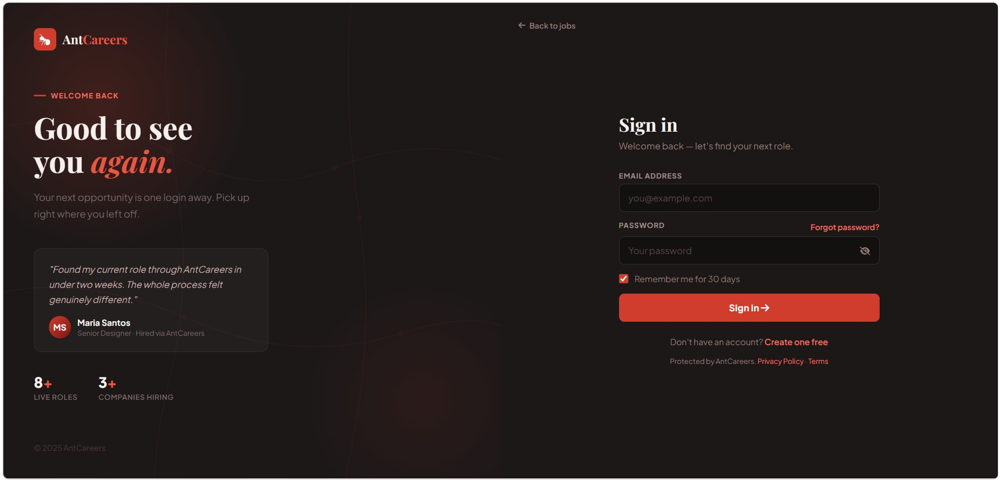
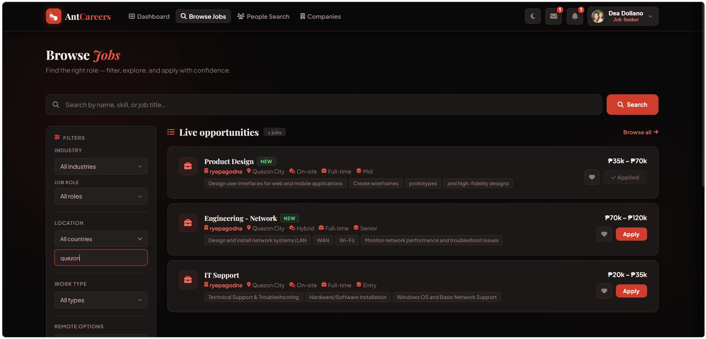
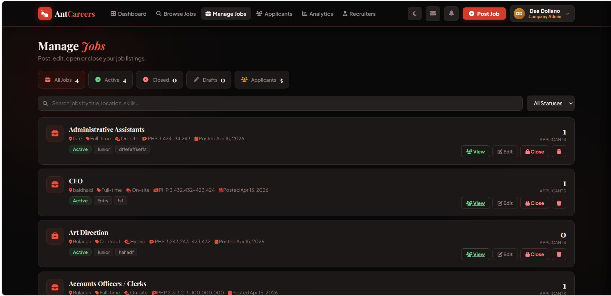

# AntCareers
### A Web-Based Job Posting and Recruitment Platform

---

## Project Title

**AntCareers: A Web-Based Job Posting and Recruitment Platform**

---

## Description of the System

AntCareers is a web-based system developed for **IT 211 – Web Systems and Technologies**. The system connects job seekers and employers in one platform. Employers can post job vacancies, manage applicants, and communicate with candidates, while job seekers can browse job listings, apply for jobs, and track their applications.

---

## Features

### Job Seeker
- Create and manage profile
- Search and filter job listings
- Apply for jobs
- Track application status

### Company Admin
- Manage company profile
- Oversee job postings

### Recruiter
- Post, edit, and delete job vacancies
- Review applicants
- Communicate with candidates

### System Admin
- Manage users
- Approve or remove job postings
- Monitor system activity

### General Features
- Secure login system
- Role-based dashboard
- Job application system
- Responsive design
- Light mode and dark mode support

---

## Technologies Used

| Layer | Technology |
|-------|------------|
| Frontend | HTML, CSS, JavaScript |
| Backend | PHP |
| Database | MySQL (phpMyAdmin) |
| Server | XAMPP (Localhost) |
| Hosting | ByetHost |
| Version Control | Git & GitHub |

---

## Installation / Setup Guide

### Localhost Setup (XAMPP)

1. **Clone the repository:**
   ```bash
   git clone https://github.com/your-username/antcareers.git
   ```

2. **Move project to:**
   ```
   C:\xampp\htdocs\antcareers
   ```

3. **Start XAMPP:** Apache + MySQL

4. **Open phpMyAdmin:**
   ```
   http://localhost/phpmyadmin
   ```

5. **Create database:** `antcareers`

6. **Import** the `.sql` file

7. **Configure `config.php`:**
   ```php
   $host = "localhost";
   $user = "root";
   $password = "";
   $database = "antcareers";
   ```

8. **Run:**
   ```
   http://localhost/antcareers
   ```

---

### Online Deployment (ByetHost)

1. Create a ByetHost account
2. Open control panel
3. Upload project to `htdocs`
4. Create MySQL database
5. Import `.sql` file using phpMyAdmin
6. **Update `config.php`:**
   ```php
   $host = "sqlXXX.byethost.com";
   $user = "your_username";
   $password = "your_password";
   $database = "your_database_name";
   ```
7. **Access:**
   ```
   http://yourdomain.byethost.com
   ```

---

## Screenshots

### Home Page
> Main landing page with job search bar and featured listings.


---

### Login Page
> User authentication for different roles.



---

### Job Listings
> Displays available jobs with filtering options.



---

### Admin – Manage Jobs
> Admin/Recruiter panel for managing and overseeing job postings.



---

## Contributors

| GitHub | Name |
|--------|------|
| HardProcastinator | Mark Reeze Maniego |
| Anyanyann | Arianne Paulene Aspiras |
| deyangg | Dea Cassandra Dollano |
| ryal1717 / rayalib5 | Ryal Eve Del Rosario |

---

## Notes

- This project is for **academic purposes only**
- Some features are simplified for demonstration
- Requires XAMPP or web hosting to run
